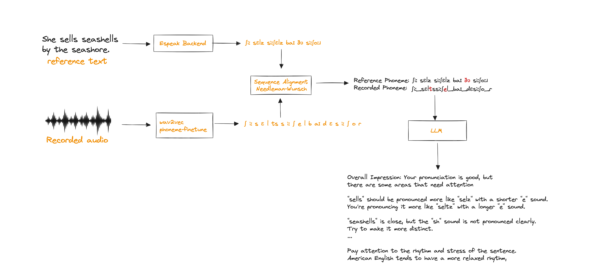

# Mispronunciation Detection and Diagnosis
Mispronunciation Detection and Diagnosis (MDD) is a technology that helps identify and correct mispronunciations in spoken language. It's designed to assist language learners, speech therapists, and anyone who wants to improve their pronunciation skills.

## How does it work?
MDD uses advanced speech processing techniques to analyze spoken language and detect mispronunciations. It then provides personalized feedback and diagnosis to help users improve their pronunciation.

## Different Approaches

**Approach 1: Speech-to-Text with Confidence Checking**  
- Use speech-to-text systems to transcribe spoken language
- Check the confidence score of each word to identify potential mispronunciations
**Limitations:**
      - Lack of detail: only identifies words with low confidence scores, not specific utterances or phonemes
      - May not detect all mispronunciations, especially if confidence scores are high

**Approach 2: Neural Network-based Phoneme Generation**
- Train a neural network to generate phonemes from speech input
- Compare generated phonemes to reference phonemes for diagnosis
**Limitations:**
      - Speaker variability: different speakers have different pronunciation patterns, making it challenging to develop a single model that works for all
      - Limited generalizability: models may not perform well across different languages or accents

**Approach 3: Multilingual Wav2Vec2 with Phoneme Fine-Tuning**
- Use pre-trained Wav2Vec2 models trained on multilingual speech dataset and fine-tuned on phoneme datasets
- Leverage multilingual capabilities to recognize phonemes across different languages and accents
**Advantages:**
      - Improved accuracy: fine-tuning on phoneme datasets enhances phoneme recognition capabilities
      - Robustness to speaker variability: multilingual training helps adapt to different pronunciation patterns

**Our Approach**  
We will use pre-trained Wav2Vec2 and Espeak to extract phoneme sequences from recorded speech and reference text, respectively. The extracted sequences are then aligned using the Needleman-Wunsch algorithm, and a Large Language Model (LLM) is used to generate feedback on mispronunciations.



**Key Features:**  
- Utilizes Wav2Vec2 for speech-to-phoneme conversion
- Employs Espeak for reference phoneme sequence generation
- Implements Needleman-Wunsch algorithm for alignment
- Integrates LLM for personalized feedback

## How to run

Install modal labs python client
Configure secrets in the modal console. 
```
modal serve modal/phoneme_modal_server.py
```

Once your phoneme recognition model is running update the MODAL_URL in the notebook. 
For the final llm call, you would need Groq api key. The final piece of code call the llama3 70b model to get the feedback based on the recorded and reference phoneme sequences.

## Key Takeaways

1. Phoneme recognition accuracy matters: If the model isn't trained to handle multiple languages and accents, it's going to struggle to recognize phonemes correctly. This is crucial for accurate mispronunciation detection.
   
2. LLMs provide consistent feedback: When I sent word-level phonemes to the Large Language Model (LLM), the feedback was consistent and correct. But if I sent it without aligning sequences first, it was hallucinating more.

3. Multimodal models simplify audio analysis: Models like Gemini 1.5 Pro can ingest audio files directly and answer questions like identifying mispronunciations, accents, or providing valuable feedback on speech. This makes audio analysis much more efficient.

4. Tailor-made practice exercises: We can keep track of all the mispronunciation patterns and ask the LLM to devise a personalized practice exercise plan. This plan would be tailored to address specific areas of improvement, helping individuals focus their practice and accelerate progress.